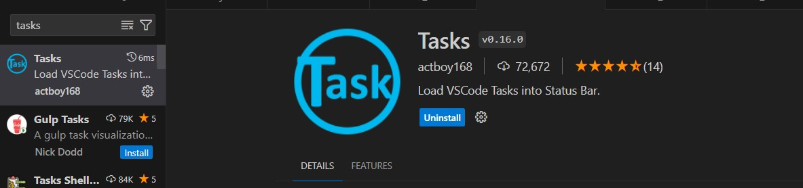
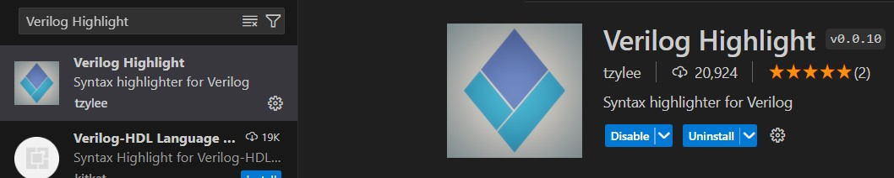
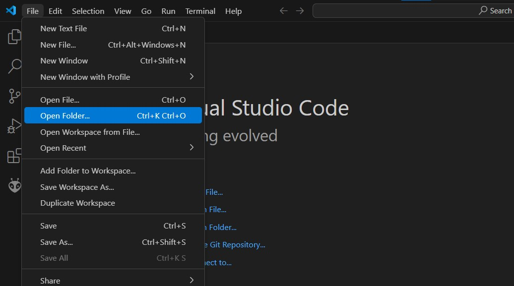
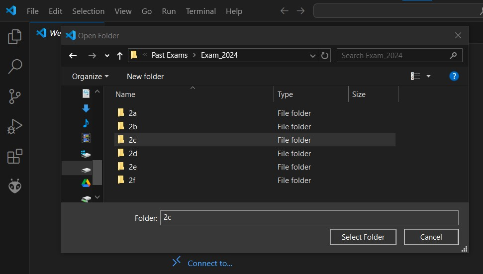
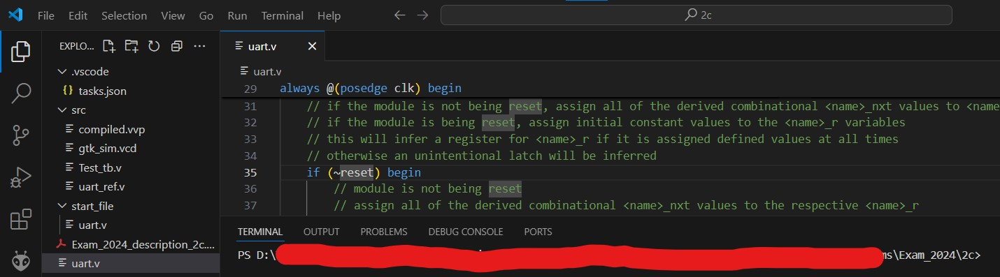
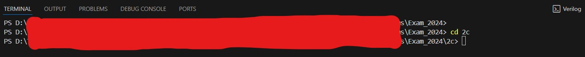
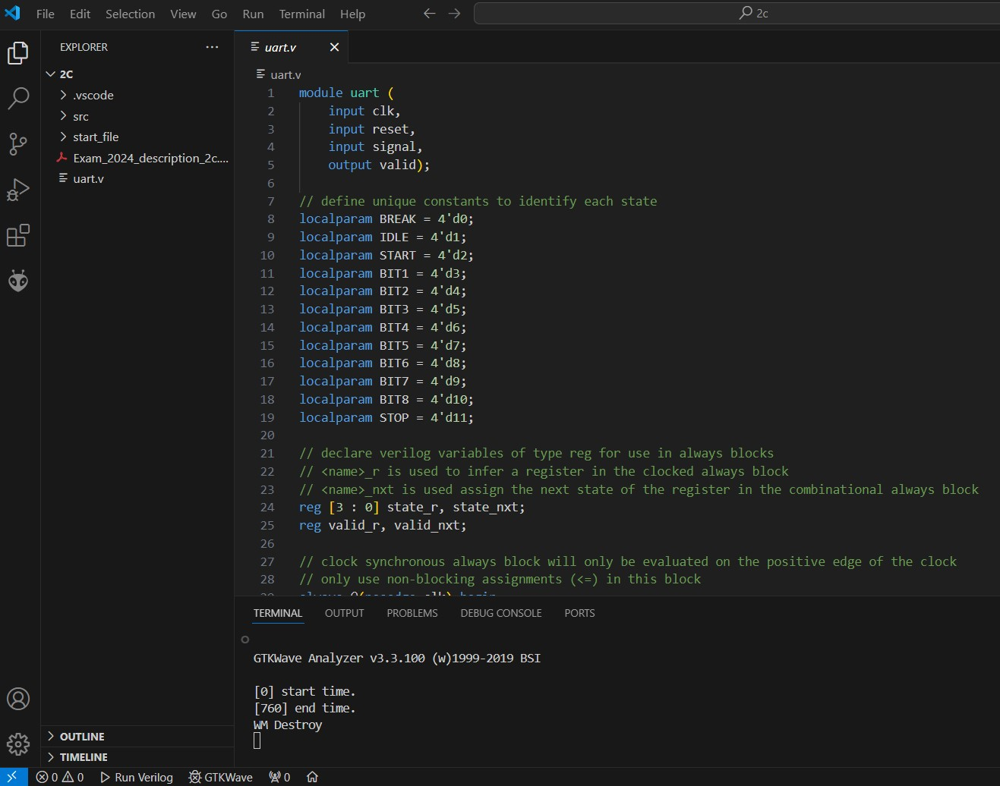
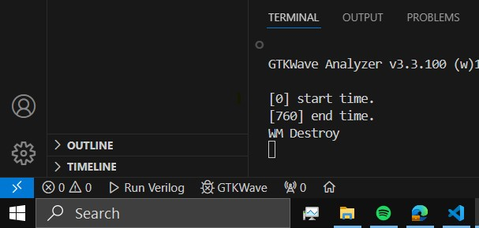

# Getting Started

🚨🚨 DO NOT SHARE THESE FOLDER WITH ANYONE. THIS WILL LEAD TO THE CREATORS OR WHOEVER IS FOUND IN POSSESSION LEGALLY LIABLE 🚨🚨

 

We made these folders to help people with the Verilog course. Be kind to everyone and do not share the folders.

The folders contain past exams, though they are not fully complete. Some are missing exercises, and others cannot be executed in VS Code. The more important point is that it is possible to run and debug the code like in the exam.
 
 

## Instalation 

In order for the setup to work you should download and install:

1. [Visual Studio Code](https://code.visualstudio.com/)

2. [Icarus Verilog](https://www.youtube.com/watch?v=3Xm6fgKAO94) - This video explains how to download and install Icarus for Visual Studio Code and how to simulate/debug the signals. (~1mins)

3. The "Tasks" extensions for VS Code

  

 

4. The "Verilog Highlight" extensions for VS Code

  

 
 

## How to do a Verilog Exam

### Open Exam in VScode

1. Open Folder of the directory of the question that you want to try.

  
  

 

2. If you have opened the correct directory, the terminal should open in the desired question path in which there should be a `.vscode` and `src`. 

  

 

(This is important because the `.vscode` folder allows VScode to know how to run the verilog, if the terminal opened path doesn't contain the folder vscode will be confused as to what to do)
 

3. If you are in a different path use the `cd` command to navigate to the correct directory.

  

 

### Evaluate Exam and Debug

4. Add you code to the `.v` file or files provided. In the case there is no such files in the main directory or you want to redo the exam from start again there should be a folder called `start_file`.

  

5. Save the added code and press the `Run Verilog` button which can be found at the left bottom corner of the VScode window as seen in the picture. If you want debug or simulate signal that the program outputs press the `GTKWave` button and a simulator window will pop up.

  

## How to AVOID PROBLEMS with the files

- **🚫 DO NOT 🚫** change the files in folders `.vscode` and `src` (unless you know what you are doing).

- If there is no file to edit or you want to program from scratch, there should be a folder `start_file` with the files you need. **DO NOT EDIT** these files. **COPY** and **PASTE** from the folder to the top directory (e.g., in the example `2e`).
